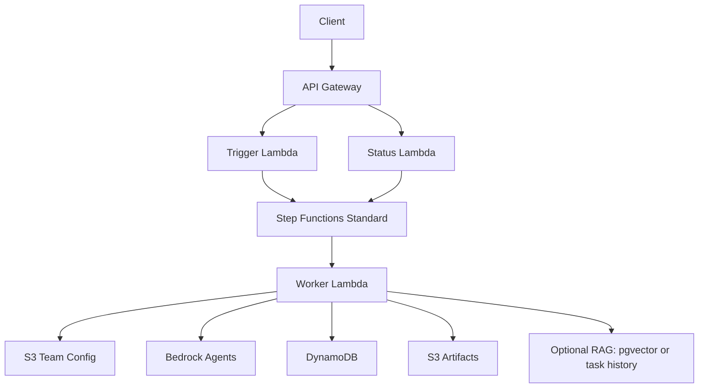

# TeamWeave

TeamWeave is a **config-driven multi-agent orchestration platform** for two practical outcomes:

1. Building high-quality content pipelines (strategy → draft → edit → distribution).
2. Building personal technical growth pipelines (coach → learning plan → daily tasks).

It runs on AWS using **API Gateway + Lambda + Step Functions + Bedrock Agents**, with DynamoDB/S3 for run state and artifacts.

---

## Architecture

TeamWeave is split into two layers:

### 1) Control Plane (request orchestration)

- **Trigger Lambda** accepts API calls and starts Step Functions executions for long-running work.
- **Status Lambda** reports execution state by `run_id`.
- **Step Functions (Standard)** invokes worker logic and provides async execution tracking.

### 2) Data/Execution Plane (multi-agent pipeline)

- **Worker Lambda** loads a team definition from S3 (`team/version/team.json`), then runs the declared workflow step-by-step.
- Each step invokes a configured **Bedrock Agent alias**.
- Responses are parsed to JSON, transformed to target schema, and persisted.
- **DynamoDB** stores run metadata, step outputs, and improvement tasks.
- **S3** stores pipeline artifacts (`runs/{run_id}/{step}.json`).
- **Optional RAG** enriches prompts from pgvector (explicit mode) or prior completed tasks (history mode).

### High-level flow



---

## Concept

TeamWeave treats a “team” as configuration, not hard-coded logic.

A team config defines:

- global constraints and feature flags,
- agent roster and Bedrock IDs,
- workflow step order + data dependencies,
- output schema references.

Because of this, you can add or evolve pipelines by changing JSON configs rather than editing orchestration code.

### Included team patterns

- **Visibility Team**: content marketing assembly line with specialized roles.
- **Improvement Team**: personal learning system that generates and tracks daily tasks.

---

## Advantages

- **Config-first extensibility**: new teams/flows can be introduced without rebuilding core runtime.
- **Strong output contracts**: schema extraction + transformation reduce brittle downstream integrations.
- **Async by design**: long AI workflows return immediately with a `run_id` and are polled via status API.
- **Built-in observability state**: run metadata + per-step records are persisted in DynamoDB.
- **RAG flexibility**: supports explicit vector retrieval and historical-learning avoidance patterns.
- **Deployment-ready AWS stack**: SAM templates for API/Lambda/Step Functions/IAM/networking.

---

## Repository Layout

- `src/orchestrator/` – runtime handlers and orchestration logic.
  - `trigger_handler.py` – starts executions and routes management endpoints.
  - `worker_handler.py` – executes pipelines and invokes Bedrock agents.
  - `status_handler.py` – execution status polling endpoint.
  - `config_loader.py` – loads team definitions from S3.
  - `rag.py` – RAG retrieval (explicit/history modes).
  - `db.py` – DynamoDB DAO for runs, steps, and tasks.
- `config/examples/` – example team configs, schemas, roles, departments, helper scripts.
- `infra/` – SAM/CloudFormation templates and deployment docs.
- `tests/` – unit tests for utility and orchestration modules.

---

## Runtime APIs

### Team workflow

- `POST /team/task` → starts a workflow run (returns `run_id` / execution ARN).
- `GET /team/task/{run_id}` and `GET /teams/task/{run_id}` → returns `RUNNING | SUCCEEDED | FAILED` and payload when available.

### Improvement tasks

- `GET /improve/tasks` → list tasks for owner.
- `POST /improve/task/done` → mark a task complete.

### Agent/team management proxy routes

The trigger function can also route CRUD-like requests for:

- `/agents`, `/agents/{name}`
- `/teams`, `/teams/{team_name}`
- `/roles`, `/roles/{role_id}`
- `/departments`, `/departments/{dept_id}`

These are dispatched through Step Functions to the provision/management lambda path and return an async execution id.

---

## Team Configuration Model (simplified)

A team file lives at:

`teams/{team}/{version}/team.json`

Core sections:

- `team`: name/version/owner
- `globals`: north star, hard constraints, feature toggles, rag mode, storage mapping
- `agents[]`: id/name/bedrock refs/goal template/schema ref
- `workflow[]`: ordered steps + declared inputs
- `schemas`: schema references to files or embedded schema objects

---

## Processing Pipeline Details

For each workflow step, TeamWeave:

1. Resolves the step agent by `id`.
2. Builds step inputs from request, RAG, owner profile, and prior step outputs.
3. Builds a prompt from config + context.
4. Invokes Bedrock Agent alias.
5. Extracts JSON from the model response.
6. Transforms output into the step schema (if configured).
7. Persists step status/output + artifact URI.
8. Applies team-specific side effects (e.g., improvement advisor writes daily tasks).

---

## Deployment (AWS SAM)

From repo root:

```bash
sam build -t infra/template.yaml
sam deploy --guided -t infra/template.yaml
```

Alternative Bedrock-agent provisioning stack details are in `infra/README.md`.

---

## Environment Variables

Important runtime variables include:

- `CONFIG_BUCKET` – S3 bucket for team configs.
- `CONFIG_PREFIX` – config prefix (default `teams`).
- `ARTIFACT_BUCKET` – S3 destination for run artifacts.
- `DDB_TABLE` – DynamoDB table for run/task persistence.
- `STATE_MACHINE_ARN` – used by trigger lambda to start executions.
- `PROVISION_FUNCTION_NAME` – lambda invoked for team/agent CRUD operation mode.
- `VECTOR_DB_*` – optional explicit RAG pgvector connection settings.
- `GEMINI_SECRET_ARN` – optional secret for Gemini research augmentation.

Most of these are wired by `infra/template.yaml`.

### Gemini research Lambda wiring

The SAM template now provisions a dedicated Gemini action-group Lambda named `pbm-gemini-research` using `config/examples/gemini_lambda.handler` and exposes its ARN to the worker as `GEMINI_LAMBDA_ARN`.

Equivalent CLI setup:

```bash
# 1. Deploy gemini_lambda.py as a Lambda function named e.g. pbm-gemini-research
# 2. Grant Bedrock permission to invoke it:
aws lambda add-permission \
  --function-name pbm-gemini-research \
  --statement-id bedrock-invoke \
  --action lambda:InvokeFunction \
  --principal bedrock.amazonaws.com

# 3. Set on your worker Lambda:
GEMINI_LAMBDA_ARN=gemini lambda
```

---

## Local Development

### Install dependencies

```bash
python -m venv .venv
source .venv/bin/activate
pip install -r requirements.txt
```

### Run tests

```bash
pytest
```

> Note: integration behavior for AWS services (Bedrock, DynamoDB, Step Functions, S3, RDS/pgvector) requires cloud credentials and infrastructure.

---

## Example request

```bash
curl -X POST "$API_URL/team/task" \
  -H 'content-type: application/json' \
  -d '{
    "team": "tarun_visibility_team",
    "version": "v1",
    "request": {
      "topic": "AI orchestration",
      "objective": "Publish one high-authority LinkedIn post",
      "audience": "engineering leaders"
    }
  }'
```

Then poll:

```bash
curl "$API_URL/teams/task/<run_id>"
```

---

## License

MIT (see `LICENSE`).
